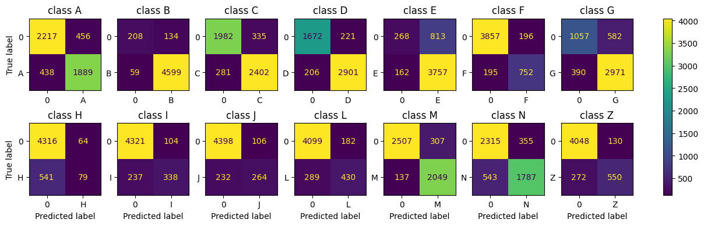

# PubMed

## Installation

```bash
git clone  https://github.com/kpetrakis/PubMed.git
cd 
virtualenv venv_name
source venv_name/bin/activate
pip install -r requirements.txt
```

Note: If virtualenv is not available you can replace:

```bash
virtualenv venv_name
```

with

```bash
python3 -m venv venv_name
```

## Reproducibility

Either download "PubMed Multi Label Text Classification Dataset Processed.csv" and place it in data/raw and run 

```bash
python parse_data.py
```

This will create the train dev and test data tensors.

Or you can download those tensors directly from the Google Drive link in the report.

## Inference API

Run

```bash
fastapi run inference_api/main.py
```

and use */inference/{text_to_classify}* endpoint to run infrence on the given text.


## How to train 

```bash
python train.py
```

## How to evaluate

```bash
python evaluate.py
```

> All train and evaluation parameters can be modified in the config.py file

### Evaluation results

```bash
test loss:   21.551227 | flat acc: 88.62 % | hamming: 0.113 | jaccard: 0.765 | zero one loss: 0.802 | f1 score: 0.853


precision    recall  f1-score   support

           0       0.81      0.81      0.81      2327
           1       0.97      0.99      0.98      4658
           2       0.88      0.90      0.89      2683
           3       0.93      0.93      0.93      3107
           4       0.82      0.96      0.89      3919
           5       0.79      0.79      0.79       947
           6       0.84      0.88      0.86      3361
           7       0.55      0.13      0.21       620
           8       0.76      0.59      0.66       575
           9       0.71      0.53      0.61       496
          10       0.70      0.60      0.65       719
          11       0.87      0.94      0.90      2186
          12       0.83      0.77      0.80      2330
          13       0.81      0.67      0.73       822

   micro avg       0.86      0.86      0.86     28750
   macro avg       0.81      0.75      0.76     28750
weighted avg       0.85      0.86      0.85     28750
 samples avg       0.86      0.87      0.85     28750

```



## Implementation details

- Python 3.11.5  
- It was tested on Artix Linux 6.5.7 and Ubuntu 22.04

## TODO

- [ ] Train better models (RoBerta)
- [ ] Add testing in inference API